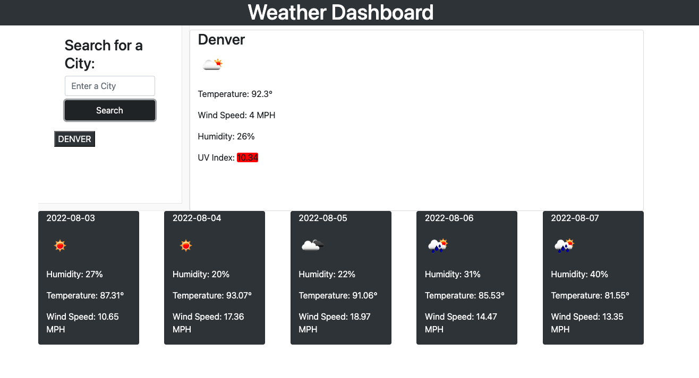

# Weather-Application

Technologies/Languages used:
HTML
CSS
JAVASCRIPT
BOOTSTRAP

APIs used:
https://openweathermap.org/api/one-call-api
https://openweathermap.org/api

On open the dashboard will be empty. 

Once a city is entered the main dashboard and the 5 day forcast will populate. A button will be added for the previous search.

As you search for more cities they add more buttons under the search. When clicking on these they will update the dashboard with that specific cities weather information.

After 5 or so searches a scroll bar will appear so you can scroll through them in a fixed box.

